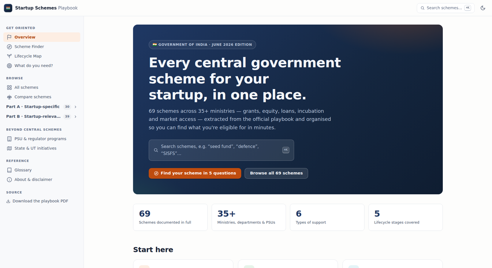
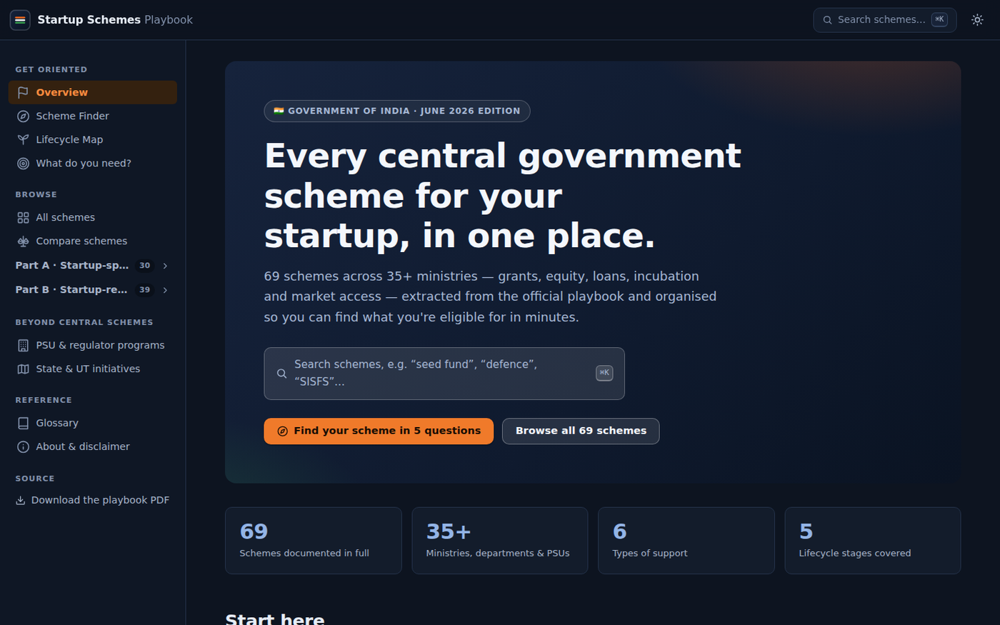
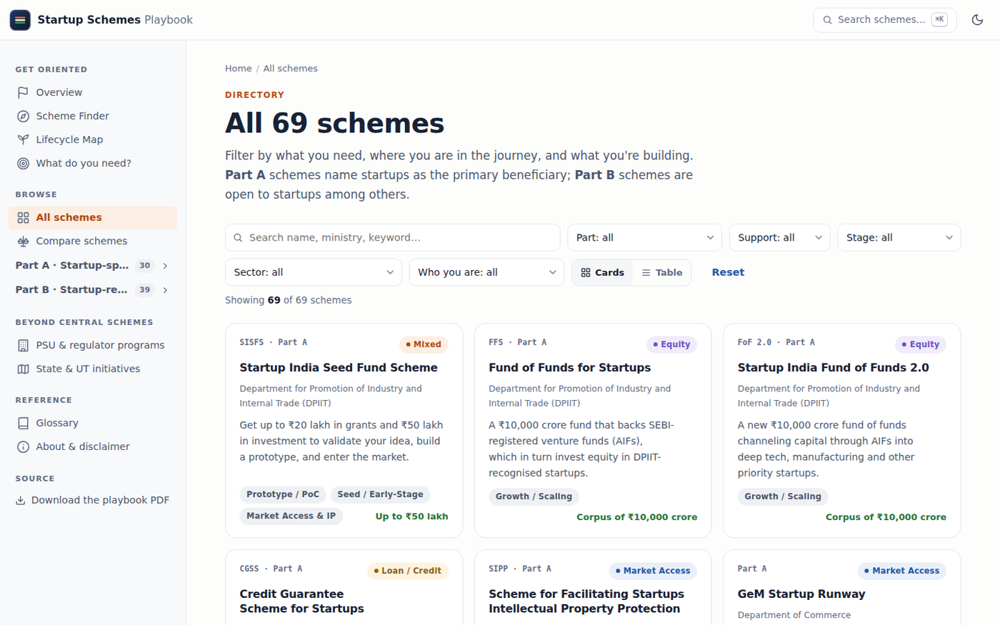
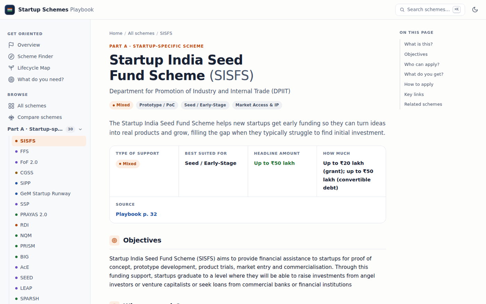
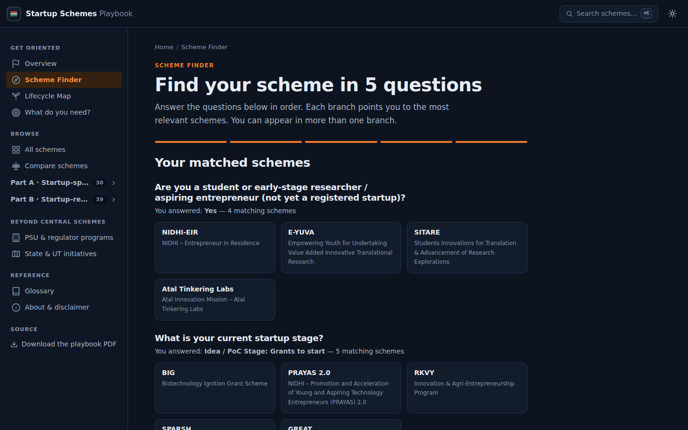

<div align="center">

# startup-india-guide

**Every central government scheme for Indian startups — one searchable, comparable, verified documentation site.**

The Government of India's 107-page *Playbook of Government Schemes and Initiatives for Startups* (June 2026), rebuilt as a docs site: 69 schemes with verbatim eligibility, benefits and official links, organised the way a founder actually looks for money — by need, by stage, by sector.

[**Live site**](https://fritzhand.github.io/startup-india-guide/) · [**Scheme Finder**](https://fritzhand.github.io/startup-india-guide/finder.html) · [**All 69 schemes**](https://fritzhand.github.io/startup-india-guide/directory.html) · [**Compare**](https://fritzhand.github.io/startup-india-guide/compare.html)

[](https://github.com/fritzhand/startup-india-guide/generate)


<br>

<a href="https://fritzhand.github.io/startup-india-guide/"></a>

*The home page. Palette sampled from the source PDF's own navy, saffron and green.*

</div>

## What it looks like

Four views from the [live site](https://fritzhand.github.io/startup-india-guide/) — dark home, the filterable directory, a scheme one-pager, the finder's results. Light/dark theme, ⌘K search, and mobile-first layout throughout.

| | |
| --- | --- |
|  |  |
|  |  |

## What's on the site

| Page | What it does |
| --- | --- |
| [Overview](https://fritzhand.github.io/startup-india-guide/) | Stats, browse by support / stage / sector, flagship schemes |
| [Scheme Finder](https://fritzhand.github.io/startup-india-guide/finder.html) | The playbook's official 5-question decision tree as an interactive wizard |
| [All schemes](https://fritzhand.github.io/startup-india-guide/directory.html) | Filter 69 schemes by part, support type, stage, sector, audience — cards or table, deep-linkable (`?support=grant&stage=ideation`) |
| Scheme pages | One per scheme: plain-English summary, eligibility checklist, benefits, how to apply, verified official links, related schemes, source-page citation |
| [Compare](https://fritzhand.github.io/startup-india-guide/compare.html) | Up to three schemes side by side |
| [Lifecycle Map](https://fritzhand.github.io/startup-india-guide/lifecycle.html) | Ideation → prototype → seed → growth → market access |
| [What do you need?](https://fritzhand.github.io/startup-india-guide/needs.html) | From a need (grant / loan / lab / buyers / IP) to the schemes that provide it |
| [State & UT schemes](https://fritzhand.github.io/startup-india-guide/state-schemes.html) | 320+ state-level startup schemes & incentives (seed grants, subsidies, reimbursements, procurement) across every state and UT — straight from each official state startup policy, by-state / all-schemes / map views. Kept separate from the central schemes |
| [Incubators directory](https://fritzhand.github.io/startup-india-guide/incubators.html) | 220+ technology business incubators, Atal Incubation Centres & startup hubs on an interactive India map (choropleth + city markers) — searchable, filterable, cards / table / state-wise views, with locations, websites and contacts |
| [PSU & regulators](https://fritzhand.github.io/startup-india-guide/psu.html) · [States & UTs](https://fritzhand.github.io/startup-india-guide/states.html) | 17 PSU/regulator programs; every state startup portal |
| [Glossary](https://fritzhand.github.io/startup-india-guide/glossary.html) · [About](https://fritzhand.github.io/startup-india-guide/about.html) | Definitions, abbreviations, disclaimer, method |

## How it works

```
Startup-Schemes-Playbook-June-2026.pdf          the source document
      │
      │  extract (text + page images) → parse → adversarially verify
      ▼
data/*.json                                     the content: 69 schemes, decision tree,
      │                                         lifecycle, needs index, PSU/states, glossary
      +
site/tokens.css + site.css + site.js            the skin (PDF-sampled palette) + engine
      │
      │  node build.mjs                         zero dependencies, fails loudly
      ▼
docs/  →  GitHub Pages                          82 static pages, ⌘K search, no runtime deps
```

1. **Extract** — every PDF page rendered to text *and* image; scheme one-pagers parsed to structured JSON; hyperlinks taken from the PDF's link annotations, never retyped.
2. **Verify** — an independent pass re-reads each source page and corrects amounts, bullets and URLs before anything ships.
3. **Build** — `build.mjs` turns `data/` + `site/` into `docs/`: directory, wizard, compare, search index, sitemap, per-scheme pages.
4. **Deploy** — pushing to `main` publishes `docs/` to the `gh-pages` branch via the included workflow.

## Use this as a template

The engine is content-agnostic: it turns any structured reference corpus — a scheme catalogue, a benefits handbook, an internal policy binder — into this site. Click **[Use this template](https://github.com/fritzhand/startup-india-guide/generate)**, then:

1. **Point it at your home.** Edit `site.config.json` — `siteName`, `siteBase`, `pathPrefix`, `repo`.
2. **Bring your content.** Replace `data/*.json` (schemes, decision tree, lifecycle, needs index, glossary). The shapes are plain and documented by example; `data/aliases.json` resolves any cross-reference spellings.
3. **Wear your brand.** `site/tokens.css` is the only file that knows the palette — light and dark themes, ~60 custom properties.
4. **Build & publish.** `node build.mjs`, push, and enable Pages (the included workflow publishes `docs/` → `gh-pages`).

The build fails loudly on duplicate slugs, missing fields, malformed URLs, or any scheme name that doesn't resolve to a page — broken cross-references can't ship silently.

## Repo tour

```
startup-india-guide/
├── Startup-Schemes-Playbook-June-2026.pdf   # the source document (also served by the site)
├── site.config.json         # template knobs: site name, base URL, path prefix, repo
├── data/                    # the extracted, verified content — single source of truth
│   ├── schemes.json         # 69 schemes: verbatim eligibility/benefits/links + tags
│   ├── decision-tree.json   # the 5-question finder
│   ├── lifecycle.json       # stage → schemes map
│   ├── needs-index.json     # need → schemes map
│   ├── state-schemes.json   # 320+ state/UT startup schemes & incentives, by state
│   ├── incubators.json      # 220+ incubators: location, type, sectors, website, contacts, lat/lng
│   ├── india-map.json       # projected + simplified India state polygons (see scripts/) for the maps
│   ├── psu.json · states.json · glossary.json · about.json
│   └── aliases.json         # printed-name → slug overrides for cross-references
├── site/                    # the engine — consumed by build.mjs
│   ├── tokens.css           # the skin: PDF-sampled palette, light + dark
│   ├── site.css             # layout & component vocabulary; reads only tokens
│   └── site.js              # search, filters, wizard, compare, incubator map, theme toggle
├── build.mjs                # data + site → docs/   (zero dependencies, Node ≥ 18)
├── scripts/build-india-map.mjs   # one-off: district GeoJSON → data/india-map.json (state paths + projection)
├── docs/                    # GENERATED — never hand-edit; what GitHub Pages serves
└── .github/workflows/deploy-pages.yml   # publishes docs/ → gh-pages on push to main
```

## Working on the site

```bash
node build.mjs                        # regenerate docs/ from data/ + site/
python3 -m http.server -d docs 8000   # preview locally (or: npx serve docs)
```

- **Content change** (an amount, a new link, a new scheme)? Edit `data/*.json`, rebuild.
- **Design change**? Edit `site/tokens.css` (palette/fonts) or `site/site.css` (components), rebuild.
- **Never edit `docs/`** — every build overwrites it.

## How the data was made

Each of the playbook's 107 pages was extracted to text and rendered to an image; every scheme one-pager was parsed into structured JSON and then **independently re-verified against the source page** — ₹ amounts, eligibility bullets, benefits and URLs are reproduced as printed, and each scheme page cites the playbook page it came from. Hyperlinks come from the PDF's link annotations, never reconstructed by hand.

## Honest limitations

- **Scheme details drift.** Deadlines, corpus sizes and application windows change after any snapshot; every page carries a "verify on the official portal" notice for exactly that reason.
- **This is an independent reference,** not a government website, and not legal or financial advice.
- **Extraction is machine-verified, not lawyer-reviewed.** The verification pass catches transcription errors; it cannot catch changes the government made after June 2026.

## License

MIT — see [LICENSE](LICENSE). The underlying playbook is a Government of India publication; this repo reproduces its content as a reference with attribution and a link to [the source PDF](Startup-Schemes-Playbook-June-2026.pdf).
